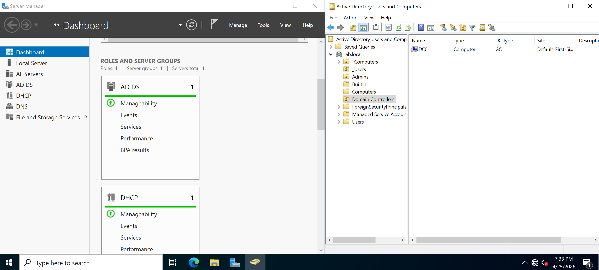
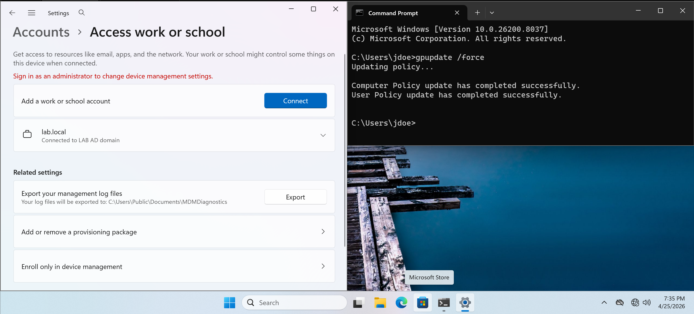
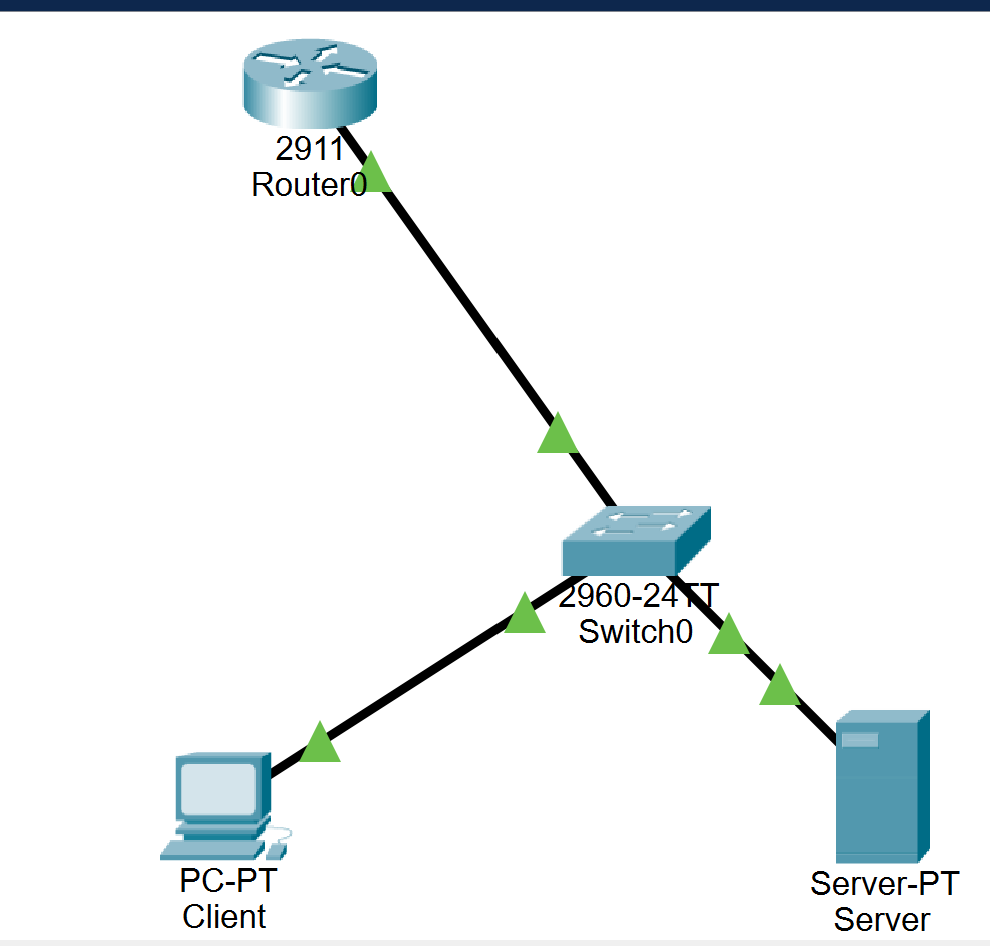

# Hybrid Networking & Identity Management Lab
A comprehensive lab environment integrating Cisco network infrastructure with Windows Server Active Directory.

### Overview
This project demonstrates the setup of a segmented corporate network using VLANs and Inter-VLAN routing, alongside a centralized Windows Domain Controller for identity management and security policy enforcement.

### Tech Stack
- **Networking:** Cisco Packet Tracer (2911 Router, 2960 Switch)
- **Virtualization:** VMware / VirtualBox
- **OS:** Windows Server 2022, Windows 10/11
- **Services:** Active Directory (AD DS), DNS, DHCP, Group Policy (GPO)

### Key Achievements
#### 1. Network Infrastructure (Cisco)
- **Segmentation:** Created VLAN 10 (Servers) and VLAN 20 (Clients).
- **Routing:** Configured Router-on-a-Stick (802.1Q) to enable communication between subnets.
- **Automation:** Set up DHCP pools on the router to automate IP assignment with custom DNS pointers.

#### 2. Systems Administration (Windows)
- **Active Directory:** Promoted a Domain Controller for the `lab.local` domain.
- **Security:** Created and linked GPOs to restrict Control Panel and Settings access for standard users.
- **Verification:** Successfully joined a client machine to the domain across different VLANs.

#### Lab Evidence
<p>
  <br>
  <em>Figure 1: Active Directory on Server</em>
</p>

<p>
  <br>
  <em>Figure 2: Successful GPO Enforcement on Client Machine</em>
</p>

<p>
  <br>
  <em>Figure 3: Logical topology of the setup</em>
</p>

#### Key Switch Commands Used
```bash
# Create the VLANs
vlan 10
 name SERVERS
vlan 20
 name CLIENTS

# Assign Access Ports (The "Driveways")
interface f0/1
 switchport mode access
 switchport access vlan 10

interface f0/2
 switchport mode access
 switchport access vlan 20

# Configure the Trunk (The "Highway")
interface g0/1
 switchport mode trunk
```
#### Key Router Commands Used
```bash
# Inter-VLAN Routing (Router-on-a-Stick)
interface g0/0.10
 encapsulation dot1Q 10
 ip address 192.168.10.1 255.255.255.0

interface g0/0.20
 encapsulation dot1Q 20
 ip address 192.168.20.1 255.255.255.0

# DHCP Service & AD Integration
ip dhcp excluded-address 192.168.10.1 192.168.10.20
ip dhcp excluded-address 192.168.20.1 192.168.20.20

ip dhcp pool CLIENT_POOL
 network 192.168.20.0 255.255.255.0
 default-router 192.168.20.1
 dns-server 192.168.10.10
